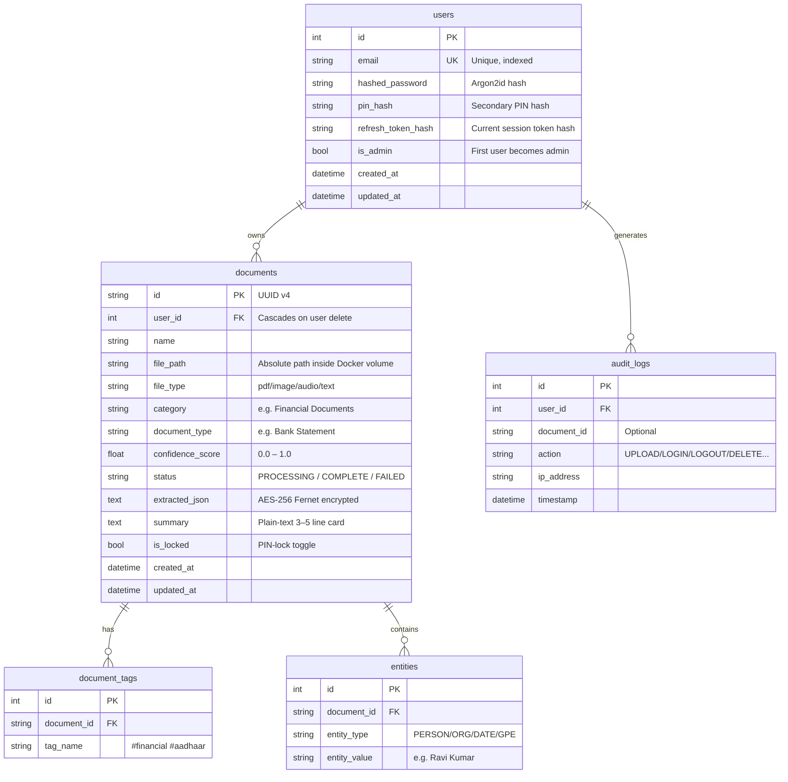

# IRIS Database Architecture & Management Guide

This document describes the PostgreSQL database schema, Alembic migration workflow, connection pooling, pgAdmin access, and backup procedures.

---

## 1. Database Engine: SQLite / PostgreSQL

By default in development, IRIS uses **SQLite** (`sqlite:///./iris.db`). In production/Docker environments, it automatically scales to **PostgreSQL 15**. Every deployment runs its own relational database instance, ensuring absolute privacy.

For SQLite:
- Single file database stored locally.
- Configured with `StaticPool` and `check_same_thread=False` to safely handle concurrent asynchronous requests.
- Runs in **WAL (Write-Ahead Logging)** mode for enhanced concurrent read/write throughput.

For PostgreSQL:
- Exposes connection pooling and robust production scaling.
- Configured via environment variables.

---

## 2. Complete Schema Reference



---

## 3. Database Indexes

Three composite indexes are created on the `documents` table to optimise the most common query patterns:

| Index Name | Columns | Purpose |
|---|---|---|
| `ix_documents_user_id` | `user_id` | List all documents for a user |
| `ix_documents_user_status` | `user_id`, `status` | Filter processing queue per user |
| `ix_documents_user_category` | `user_id`, `category` | Smart folder filtering |

---

## 4. Connection Pooling

The database engine is configured with SQLAlchemy's `QueuePool`:

| Setting | Value | Description |
|---|---|---|
| `pool_size` | 10 | Persistent connections kept alive |
| `max_overflow` | 20 | Extra connections allowed during burst |
| `pool_pre_ping` | True | Validates connection before use |
| `pool_recycle` | 3600s | Recycles connections every 1 hour |

---

## 5. Schema Migrations (Alembic)

IRIS uses **Alembic** to manage database schema changes. Migrations ensure your database structure stays in sync with the application code across updates.

### How to initialise Alembic (first-time setup only)

```bash
cd backend
alembic init alembic
```

### Generate a new migration after model changes

```bash
alembic revision --autogenerate -m "describe_your_change_here"
```

### Apply all pending migrations

```bash
alembic upgrade head
```

### Roll back the last migration

```bash
alembic downgrade -1
```

> [!NOTE]
> On Docker deployments, migrations run automatically on startup via the `CMD` in the Dockerfile or an entrypoint script. You should not need to run them manually.

---

## 6. pgAdmin — Visual Database Management

pgAdmin is an optional service you can add to your `docker-compose.yml` to inspect and manage your PostgreSQL database through a web browser.

### Add pgAdmin to docker-compose.yml

```yaml
pgadmin:
  image: dpage/pgadmin4
  container_name: iris_pgadmin
  restart: unless-stopped
  environment:
    PGADMIN_DEFAULT_EMAIL: admin@iris.local
    PGADMIN_DEFAULT_PASSWORD: admin
  ports:
    - "5050:80"
  networks:
    - iris-net
```

### Connect pgAdmin to your database

1. Open **http://localhost:5050** in your browser.
2. Log in with the credentials above.
3. Right-click **Servers → Register → Server**.
4. Fill in:
   - **Name**: `IRIS`
   - **Host**: `postgres`
   - **Port**: `5432`
   - **Database**: value of your `POSTGRES_DB` env var
   - **Username**: value of your `POSTGRES_USER` env var
   - **Password**: value of your `POSTGRES_PASSWORD` env var

> [!WARNING]
> Remove pgAdmin from `docker-compose.yml` in production or ensure it is not accessible from the public internet. It exposes your raw database.

---

## 7. Backup & Restore

See [DEPLOYMENT.md](DEPLOYMENT.md#6-backup--restore) for full backup and restore instructions.

The `scripts/backup.sh` script performs a `pg_dump` of the entire database and packages it with uploads and ChromaDB into a single archive.
