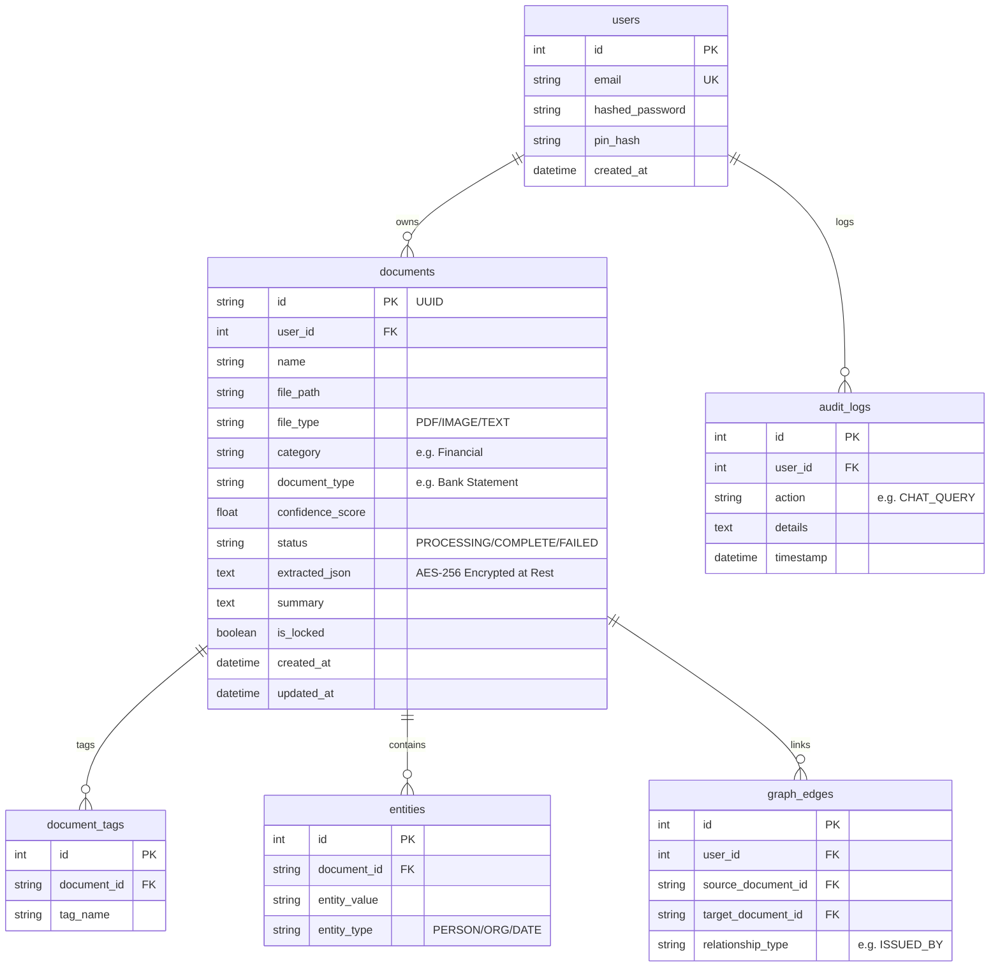

# NeuroVault Database Architecture & Management Guide

This document describes how the database is structured, managed, and queried in NeuroVault, and details how you can migrate from the default SQLite engine to a production-grade PostgreSQL system managed with pgAdmin.

---

## 1. Database Schema & Architecture

NeuroVault utilizes **SQLAlchemy** (Object-Relational Mapping / ORM) to manage database tables. By default, the application is configured to run with a local **SQLite** database (`neurovault.db`) in the backend root directory.

### Relational Table Design



---

## 2. Table Orchestration (How main things are handled)

### A. Table Creation on Startup
Tables are automatically instantiated using SQLAlchemy declarative metadata on server startup inside `backend/app/main.py`:
```python
from app.database import engine, Base
from app.models import User, Document, DocumentTag, Entity, GraphEdge, AuditLog

# Create SQLite/PostgreSQL tables on startup
Base.metadata.create_all(bind=engine)
```

### B. Session Management
Requests retrieve database sessions via FastAPI's Dependency Injection (`Depends(get_db)`):
```python
def get_db():
    db = SessionLocal()
    try:
        yield db
    finally:
        db.close()
```

### C. Sensitive Field Encryption
Before writing `extracted_json` to the database, sensitive fields (such as Aadhaar numbers or salaries) are processed/encrypted using AES-256. Conversely, when queried, the JSON payload is read and selectively masked inside the API layers before sending to the client UI.

---

## 3. Do We Need PostgreSQL & pgAdmin?

**No, PostgreSQL is not required for local development or single-user usage.** 
The default **SQLite** is zero-configuration, lightweight, and perfect for offline private systems.

### When should you migrate to PostgreSQL?
*   **Multi-User Operations**: When multiple clients need concurrent read/write capabilities (SQLite locks the entire database file during writes).
*   **High Performance & Scale**: When processing thousands of documents, where database indexing, scaling, and query tuning are needed.
*   **Production Hosting**: When deploying the backend in a container orchestration setup (Kubernetes, AWS ECS, GCP) where local storage is ephemeral.

---

## 4. Migrating to PostgreSQL & pgAdmin (Step-by-Step)

Here is exactly how to set up PostgreSQL and manage it via **pgAdmin**.

### Step 1: Install PostgreSQL Driver
Open your terminal in the backend directory and install the PostgreSQL connection driver:
```bash
cd backend
.venv\Scripts\pip install psycopg2-binary
```

### Step 2: Run PostgreSQL & pgAdmin via Docker Compose
Update your root `docker-compose.yml` to include the PostgreSQL database and pgAdmin service:

```yaml
version: '3.8'

services:
  db:
    image: postgres:15-alpine
    container_name: neurovault_postgres
    restart: always
    environment:
      POSTGRES_USER: neuro_user
      POSTGRES_PASSWORD: SecretPassword123
      POSTGRES_DB: neurovault
    ports:
      - "5432:5432"
    volumes:
      - pgdata:/var/lib/postgresql/data

  pgadmin:
    image: dpage/pgadmin4
    container_name: neurovault_pgadmin
    restart: always
    environment:
      PGADMIN_DEFAULT_EMAIL: admin@neurovault.ai
      PGADMIN_DEFAULT_PASSWORD: AdminPassword123
    ports:
      - "5050:80"
    depends_on:
      - db

volumes:
  pgdata:
```

### Step 3: Configure `.env` Variable
Update the database connection string in your `backend/.env` file:
```env
DATABASE_URL=postgresql://neuro_user:SecretPassword123@db:5432/neurovault
```
*(If running backend on host and Postgres in Docker, use `@localhost:5432` instead).*

### Step 4: Login & Manage Databases using pgAdmin
1. Open your browser and navigate to **`http://localhost:5050`** (pgAdmin UI).
2. Log in with the configured pgAdmin credentials:
   - **Email**: `admin@neurovault.ai`
   - **Password**: `AdminPassword123`
3. Connect pgAdmin to your PostgreSQL Database instance:
   - Right-click **Servers** -> **Register** -> **Server...**
   - **General Tab**: Name it `NeuroVault DB`.
   - **Connection Tab**:
     - **Host name/address**: `db` (or `localhost` if running pgAdmin locally outside Docker).
     - **Port**: `5432`.
     - **Maintenance database**: `neurovault`.
     - **Username**: `neuro_user`.
     - **Password**: `SecretPassword123`.
4. Click **Save**. You will see the database structure under `Databases -> neurovault -> Schemas -> public -> Tables`. SQLAlchemy will auto-generate all tables there upon your first API startup.
