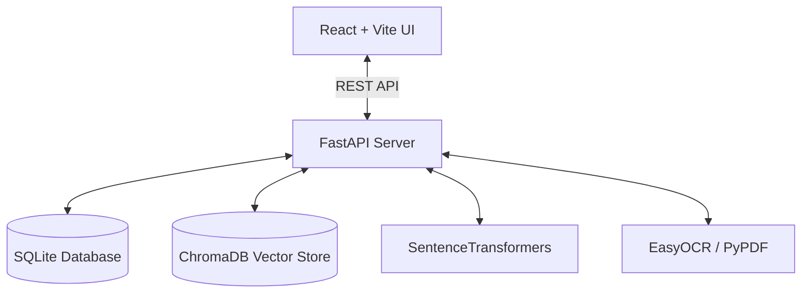
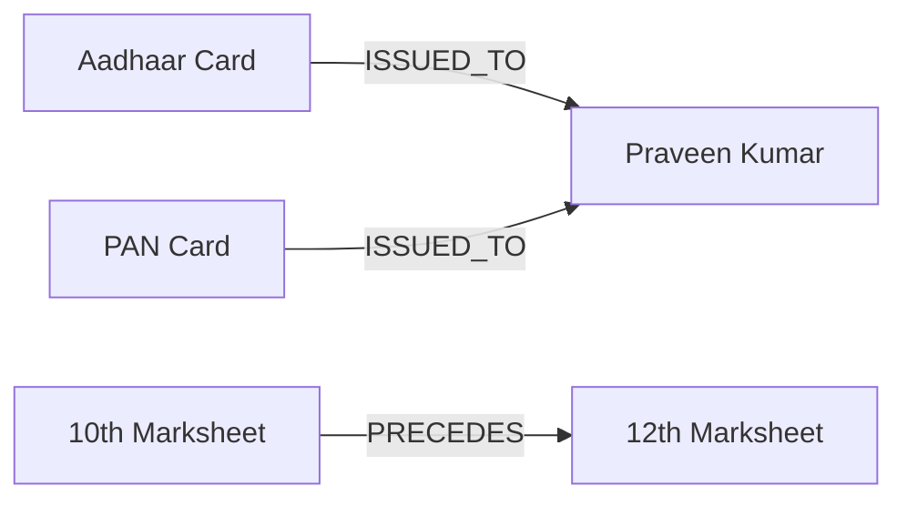

# NeuroVault AI — Technical Specification

This document details the system design, pipeline mechanics, Knowledge Graph architecture, and security rules of the NeuroVault platform.

---

## 1. System Architecture

NeuroVault is a local-first application designed to orchestrate document storage, metadata extraction, and RAG queries. It integrates a relational database, an embedded vector store, and a local OCR pipeline.

### Core Components
- **React Frontend**: A clean dashboard UI built using TypeScript and React. It uses React Flow for knowledge graphs and Zustand for client-side state.
- **FastAPI Backend**: Exposes document upload, vault queries, and RAG endpoints, orchestrating the document queue.
- **SQLite Database (via SQLAlchemy)**: Manages relational data schemas, including users, documents, document tags, entities, audit logs, and graph relationship edges.
- **ChromaDB Vector Store**: Indexes 384-dimensional vector embeddings of document summaries and extracted metadata fields.
- **Offline ML Engines**:
  - `SentenceTransformer` (`all-MiniLM-L6-v2`) for generating text embeddings.
  - `EasyOCR` for layout OCR on image blocks and scanned PDF pages.
  - `spaCy` (`en_core_web_sm`) for named-entity recognition (NER) extraction.
  - `pypdf` for text-layer extraction of digital PDF uploads.

---

## 2. Ingestion Pipeline & Classification

Uploaded files enter a multi-stage background pipeline that updates the document's state as it completes stages:

1. **Upload & Enqueue**: The backend saves the raw file, creates a record in the `PROCESSING` state, and returns a task ID to the frontend.
2. **Text Extraction**:
   - For **digital PDFs**, `pypdf` extracts the text layer directly.
   - For **scanned PDFs and images**, the pipeline extracts page images and runs `EasyOCR` on those blocks.
3. **Taxonomy & Extraction**: Classifies the file into categories (Identity, Academic, Financial, etc.) and extracts key metadata fields (e.g. Aadhaar/PAN numbers, birth dates, names).
4. **Summary & Scoring**: Generates a brief summary card and computes extraction confidence scores.
5. **Entity Recognition (spaCy)**: Mines entities (persons, organizations, dates, locations) for relationship mapping.
6. **Vector Indexing**: Generates text embeddings and indexes them in ChromaDB.
7. **Graph Linkage**: Relates the document to other files based on mutual entities.
8. **Final SQLite Update**: Writes extracted JSON, tags, and summary card data to the database, setting the status to `COMPLETE`.

---

## 3. Clustered Knowledge Graph

The **Knowledge Graph** links separate documents based on shared attributes, preventing data isolation.

### Layout Engine
To resolve layout overlap and spaghetti lines, the graph is organized using a **Document-Centric Clustered Layout**:
- **Documents Row**: Files are placed horizontally in a top grid row.
- **Entity Clusters**: Entities connected to a single document are fanned out in a downward semi-circular arc directly underneath their parent file.
- **Shared Attribute Nodes**: Entities shared by multiple documents (e.g., matching name or company) are placed in a middle bridging row to visually illustrate intersections.
- **Orphan Nodes**: Unconnected elements are aligned in a bottom grid row.

---

## 4. Security & Data Protection

The system is designed to safeguard PII in compliance with standard data protection guidelines:

- **Secondary PIN Lock**: Sensitive documents can be locked with a bcrypt-hashed PIN. Locked documents are omitted from RAG context queries and file previews.
- **PII Data Masking**: Frontend components mask sensitive numbers automatically (e.g., Aadhaar displays as `XXXX-XXXX-1234`, PAN as `ABCDE****F`).
- **Audit Logs**: Every action (Upload, View, Lock/Unlock, Delete, Query) writes a row to the system audit trail database.
- **Permanent Purges**: Deleting a file purges the relational record, the disk storage file, all vectors in ChromaDB, and all associated graph edges.

---

## 5. Resolved Bugs & Optimizations

- **Digital & Scanned PDF OCR Fallback**: Resolved OCR extraction failures on scanned PDFs by implementing page-image extraction via `pypdf` and routing them to EasyOCR. Added direct text-layer extraction for digital PDFs.
- **Docker ML Weight Preloader**: Added pre-download layers in `Dockerfile` to pull and cache PyTorch, EasyOCR, and spaCy models during docker build. Models load instantly from local storage at runtime.
- **Docker Mount Cache Caching**: Configured persistent docker volumes for `/root/.cache/huggingface` and `/root/.easyocr` so model weights remain cached on the host.
- **Real-Time Client Status Polling**: Replaced client-side simulated timers with a status check loop that queries the API every 800ms, immediately updating the UI once backend processing is completed.
- **Smart Folder Sidebar Navigation**: Fixed folder clicks appearing to do nothing by adding router navigation to redirect users to `/vault` upon folder selection.
- **PyTorch/torchvision Compatibility**: Resolved a runtime crash (`torchvision::nms does not exist`) by packaging both `torch` and `torchvision` CPU-builds together in the installation step.
